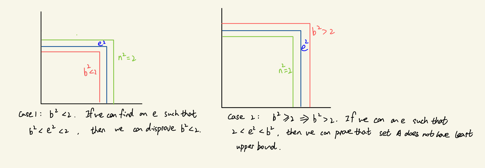
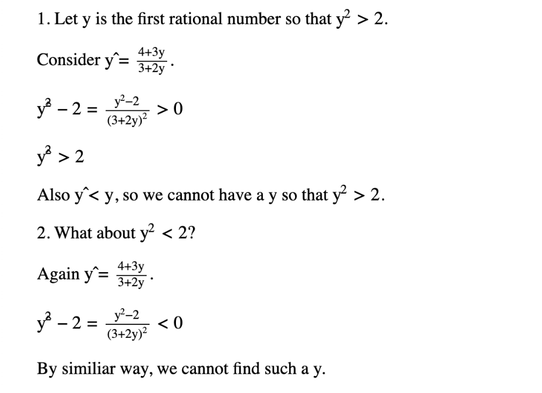

## Theorem: The rational line is not complete.
**Proof**: By contradiction. Assume the rational line is complete. 
            Then there exists a counterexample. Let A={x \in \mathbb{Q} |  x\leq 0  and  x^2  <2}.  \forall a \in A  a<2. So 2 is a upper bound of A. Now we need to show that A doesn't have a least upper bound. 
            
            

## Supplementary Materials
https://home.iitk.ac.in/~psraj/mth101/lecture_notes/lecture1.pdf